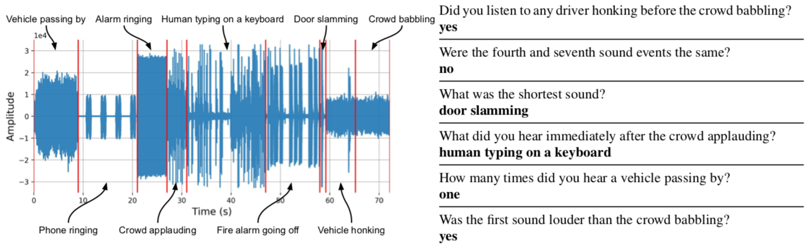

# Audio Question Answering

Code for paper: [Temporal Reasoning via Audio Question Answering](https://arxiv.org/abs/1911.09655)

Audio files are found [here](https://dl.fbaipublicfiles.com/daqa/daqa-audio.tar.gz). Trained models are found [here](https://dl.fbaipublicfiles.com/daqa/daqa-models.tar.gz).

All code was developed and tested using Python 3.6 and 3.7 on OSX and Ubuntu 18.04.

# Diagnostic Audio Question Answering (DAQA)

Instructions to generate the DAQA dataset are found [here](daqa-gen/README.md).

<p align="center"></p>

# Multiple Auxiliary Controllers for Linear Modulation (MALiMo)

Instructions for training and running trained models are found [here](daqa-mod/README.md).

<p align="center"></p>

# License

Code is released under the CC-BY 4.0 license. See [LICENSE](LICENSE) for additional details.

# Citation

If you find this code useful in your research, please cite it:

```bibtex
@inproceedings{fayek2019temporal,
  title = {Temporal Reasoning via Audio Question Answering},
  author = {Haytham M. Fayek and Justin Johnson},
  year = {2019},
}
```
