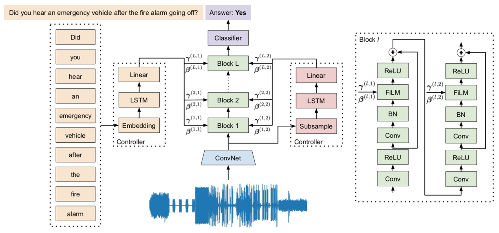

# Diagnostic Audio Question Answering (DAQA)

Code to train and test baselines models and Multiple Auxiliary Controllers for Linear Modulation (MALiMo) as described in [Temporal Reasoning via Audio Question Answering](https://arxiv.org/abs/1911.09655).

<p align="center"></p>

# Setup

**Requirements.** Make sure the requirements listed in the parent directory are installed.
[See this tutorial for detailed instructions](https://docs.python.org/3/tutorial/venv.html). You can set up a virtual environment as follows.

```bash
virtualenv -p python3 .env # Create virtual environment
source .env/bin/activate # Activate virtual environment
pip install -r requirements.txt # Install dependencies
# Get things done.
deactivate # Exit virtual environment
```

**Trained Models.**  Models can be either trained from scratch or downloaded from the following link.

```bash
wget https://dl.fbaipublicfiles.com/daqa/daqa-models.tar.gz
```

**Symlinks.** Set some symlinks.

```bash
daqa_dir=../daqa-dataset
models_dir=../daqa-models
train_dir=../daqa-train
```

# Compute Audio Features

Process the audio in all three sets into Mel-Frequency Spectral Coefficients (MFSCs).

```bash
for set in train val test
do
python3 compute_audio_features.py \
  --input-wavs $daqa_dir/audio/$set \
  --input-features $daqa_dir/features/$set \
  --astype float32 \
  --compute-features \
  --output-features $daqa_dir/features/$set \
  --output-file $daqa_dir/features/daqa_audio_${set}.hdf5
done
```

# Train MALiMo

The following command can be used to train the best MALiMo model described in the paper.
This requires *m* GPUs for a batch size of *m*, since the audio is of variable length, each GPU can only process a single audio.
Nevertheless, we can process all questions and answers that belong to that audio on the same GPU, which is how the distributed training is designed.
Hence, the actual batch size is *m \* j*, where *j* is the number of questions for each audio in the set.
See [main.py](main.py) and [data.py](data.py) for more details.
By default, `--multi-gpus` uses all available GPUs, use the `CUDA_VISIBLE_DEVICES` variable to control the GPU visibility and batch size.


```bash
python3 main.py \
  --audio-training-set $daqa_dir/daqa_audio_train.hdf5 \
  --qa-training-set $daqa_dir/daqa_train_questions_answers_5.json \
  --audio-test-set $daqa_dir/daqa_audio_val.hdf5 \
  --qa-test-set $daqa_dir/daqa_val_questions_answers.json \
  --multi-gpus \
  --distributed-parallel \
  --resume \
  --model malimo \
  --embedding-dim 256 \
  --lstm-hidden-dim-q 512 \
  --num-lstm-layers-q 2 \
  --num-conv-filts 32 \
  --num-conv-layers 3 \
  --lstm-hidden-dim-a 512 \
  --num-lstm-layers-a 2 \
  --use-coordinates \
  --num-conv-filts-film 128 \
  --num-conv-layers-film 6 \
  --fcn-output-dim 512 \
  --fcn-coeff-dim 1 \
  --fcn-temp-dim 1 \
  --aggregate mean \
  --output-hidden-dim 1024 \
  --optimizer adam \
  --lr 0.0001 \
  --l2 0.00001 \
  --batch-size 8 \
  --epochs 100 \
  --save-model \
  --model-dir $train_dir \
  --model-name malimo.pt
```

# Test MALiMo

The following command can be used to test the best MALiMo model described in the paper.
The command can also be adapted to test any of the pretrained models found [here](https://dl.fbaipublicfiles.com/daqa/daqa-models.tar.gz).

```bash
python3 main.py \
  --audio-training-set $daqa_dir/daqa_audio_train.hdf5 \
  --qa-training-set $daqa_dir/daqa_train_questions_answers_5.json \
  --audio-test-set $daqa_dir/daqa_audio_test.hdf5 \
  --qa-test-set $daqa_dir/daqa_test_questions_answers.json \
  --resume \
  --model malimo \
  --embedding-dim 256 \
  --lstm-hidden-dim-q 512 \
  --num-lstm-layers-q 2 \
  --num-conv-filts 32 \
  --num-conv-layers 3 \
  --lstm-hidden-dim-a 512 \
  --num-lstm-layers-a 2 \
  --use-coordinates \
  --num-conv-filts-film 128 \
  --num-conv-layers-film 6 \
  --fcn-output-dim 512 \
  --fcn-coeff-dim 1 \
  --fcn-temp-dim 1 \
  --aggregate mean \
  --output-hidden-dim 1024 \
  --batch-size 1 \
  --model-dir $train_dir \
  --model-name malimo.pt.best \
  --infer-only
```

# License

Code is released under the CC-BY 4.0 license. See [LICENSE](LICENSE) for additional details.

# Citation

If you find this code useful in your research, please cite:

```bibtex
@inproceedings{fayek2019temporal,
  title = {Temporal Reasoning via Audio Question Answering},
  author = {Haytham M. Fayek and Justin Johnson},
  year = {2019},
}
```
